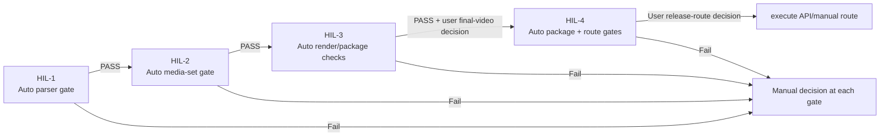

# Episode HIL-1..4 Core Flow Contract (v1.0)

This contract is for reusable episode workflows so we do not create per-episode
or per-run scripts for each new episode.

## HIL contract

- `HIL-1` = prompt packet and source shaping.
- `HIL-2` = candidate intake + preview-risk review.
- `HIL-3` = full local render + thumbnail candidate + top-level comment draft.
- `HIL-4` = approved upload + post-upload operations + schedule.

## Shared pipeline rule

- One HIL runner script (shared code), no per-episode orchestration code.
- Episode differences live in:
  - `channel/episodes/<episode-id>/manifest.json`
  - per-episode source/reviews/tracking files
  - candidate evidence in `candidates/<episode-id>/...`
- New episode work is still gated by explicit user instruction per HIL.

## Stage check profile (shared, reusable)

| Stage | Shared scope | Enter condition | Typical outputs |
|---|---|---|---|
| `hil-1` | Prompt packet | HIL-1 instruction | source pack, `manifest.json`, source reviews |
| `hil-2` | Preview + fix | `hil-1` complete | local media map, intake notes, risk segment notes |
| `hil-3` | Full render / thumbnail / comment prep | `hil-2` complete | final local candidate `.mp4`, thumbnail candidate, comment draft |
| `hil-4` | Upload + schedule | `hil-3` complete | API packages, publish-ready execution plan, schedule note |

### HIL by gate type (auto vs decision)

```text
hil-1: auto checks
  - manifest + source docs presence
  - suno track parser checks (required 13 files, required 5.5 fields, approx BPM, structure overlap, anti-pattern, overlap with prior episodes)
  - fail -> cannot move forward

hil-2: auto + local evidence
  - audio/visual local evidence presence
  - candidate-set continuity (selected + pool by track index 01-13, exact 13 each)
  - strict variant lock: selected must be `aud-tXX_c01...`, pool must be `aud-tXX_c02...`
  - filename parse health (track index/variant must be readable)
  - review notes + proof/review risk evidence required
  - fail -> cannot move forward

hil-3: auto file checks
  - subtitles + final local render + review artifacts + thumbnail + comment draft
  - still requires final-video approval decision outside script

hil-4: auto + release package checks
  - upload/thumbnail API package, release decision evidence, tracking completeness
  - still requires release-route decision before execute commands
```



## Recommended commands

- Check HIL readiness quickly:
  - `bash scripts/dev-python.sh scripts/episode_hil_flow.py --episode-id s01e04-bookstore-afternoon-longplay`
  - `bash scripts/dev-python.sh scripts/episode_hil_flow.py --episode-id ... --hil 3`
  - `bash scripts/dev-python.sh scripts/episode_hil_flow.py --episode-id ... --hil 3 --json`

## One-liner sequence for next episode

For a new episode `s01e05-...`:

1. Scaffold packet:

```bash
bash scripts/dev-python.sh scripts/bootstrap_episode_packet.py --episode-id s01e05-night-moon-longplay --prepared-by Mayr --prepared-date 2026-06-03
```

2. Verify Gate 0 and HIL-1 source packet readiness:

```bash
bash scripts/dev-python.sh scripts/episode_hil_flow.py --episode-id s01e05-night-moon-longplay
bash scripts/dev-python.sh scripts/episode_hil_flow.py --episode-id s01e05-night-moon-longplay --hil 1 --json
```

3. After user confirms real local media exists and HIL-2 is opened:

```bash
bash scripts/dev-python.sh scripts/episode_hil_flow.py --episode-id s01e05-night-moon-longplay --hil 2
bash scripts/dev-python.sh scripts/episode_hil_flow.py --episode-id s01e05-night-moon-longplay --hil 2 --json
```

4. After final-video approval, prepare release-route package:

```bash
bash scripts/dev-python.sh scripts/episode_hil_flow.py --episode-id s01e05-night-moon-longplay --hil 3 --json
```

5. After route approval, run HIL-4 execution checks:

```bash
bash scripts/dev-python.sh scripts/episode_hil_flow.py --episode-id s01e05-night-moon-longplay --hil 4
bash scripts/dev-python.sh scripts/episode_hil_flow.py --episode-id s01e05-night-moon-longplay --hil 4 --json
```

Shortcut command:

```bash
bash scripts/run_hil.sh --json s01e05-night-moon-longplay
```

or run one stage only:

```bash
bash scripts/run_hil.sh --hil 3 --json s01e05-night-moon-longplay
```

## HIL-1 auto checks (ใหม่)

HIL-1 now runs an auto source-content gate in addition to file presence checks:

- `source/suno-tracks/*.md` ต้องมีครบ 13 ไฟล์
- แต่ละไฟล์ต้องมี Suno 5.5 fields:
  - Song Title, Lyrics Mode, Lyrics, Styles (with approx BPM), Exclude Styles, Vocal Gender, Weirdness, Style Influence, Reject Criteria
- Lyrics ต้องมี pre-song context/control block ก่อน section แรกของเพลง เช่น `[Song Context]`, `[Vocal Direction]`, `[Arrangement Map]`, หรือ `[Duration Target]`
- Styles ต้องไม่เป็นแค่ genre/mood tags กว้าง ๆ: ต้องมี BPM, vocal lane, instrumentation, arrangement arc, mix/timbre, และ 3-minute/full-length target
- Exclude Styles ต้องกัน lyric drift/auto-lyrics, random vocal drift, under-3-minute sketch, abrupt ending, imitation, และ unsafe lanes
- โครงสร้าง/แบบแปลกที่ซ้ำซ้อนของเนื้อเพลง:
  - `No ..., no ...`
  - `Maybe...`, `Nothing...` (opening-line pattern)
  - `one small/soft note/sign/line` payoff pattern
  - ตำแหน่ง title phrase ใน chorus/refrain ที่ซ้ำในไฟล์เดียวกัน
  - final hook/section repeat stacking
- ตรวจความซ้อนทับทางคำแบบกึ่งอัตโนมัติ:
  - watchlist words ซ้ำติดต่อกันใน adjacent tracks
  - section-signature ที่ซ้ำมากเกิน
  - title overlap กับ track ใน episode เดิมและ episode เก่ากว่านั้น (title shape/ratio)

ตัวอย่างการรัน:

```bash
bash scripts/run_hil.sh --hil 1 --json s01e04-bookstore-afternoon-longplay
```

## HIL-4 split from user request

- `HIL-3` keeps thumbnail generation/comment draft local.
- `HIL-4` handles:
  - final video API/manual upload handoff,
  - thumbnail upload,
  - top-level comment insertion, with an existing-comment scan that blocks exact duplicate channel comments unless `--force-repost` is explicitly supplied (pin still manual unless a supported official route is added),
  - schedule visibility/final timing action under explicit account gate.

## Boundary note

The contract does not approve:
- provider/browser/account automation by default,
- public release/rights/platform-safety claims,
- scheduling without explicit gate.

This remains explicit, narrow, and episode-level by default.
