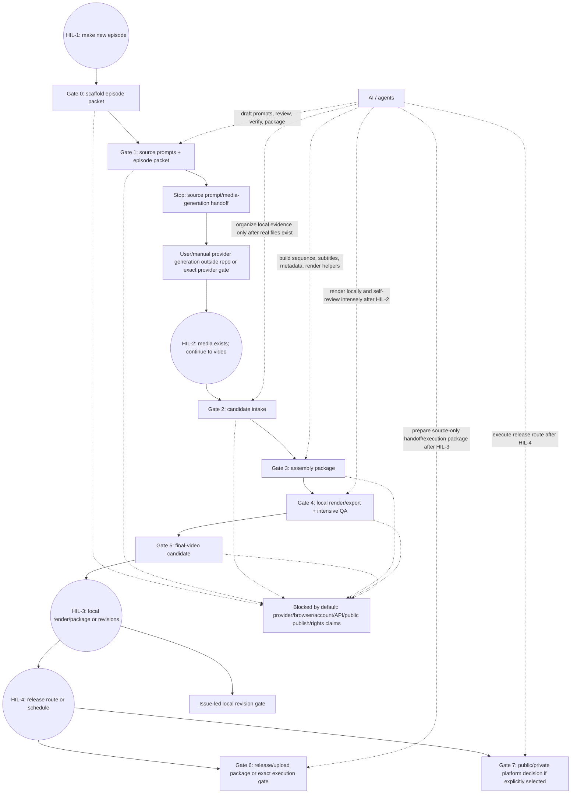

# Mellow Longplay Workflow Map

Status: active orientation map / four-HIL fastlane
Updated: 2026-05-27

## 0. Read This First

This map explains where the workflow lives, where the four planned
Human-In-The-Loop (HIL) decisions happen, what AI/agents may do, and what
evidence is required to pass each internal gate.

Boundary: this map does not approve provider use, generated media, render/export,
upload, public publish, scheduling, API/browser/account automation, credential
storage, Content ID action, private analytics capture, or positive
rights/platform-safety claims.

## 1. Current Position

```text
S01E01: Successfully released manually on YouTube (video ID: 4pOLXPMQO5g).
S01E02: Successfully released manually on YouTube (video ID: KZNjs0Z7-Pw).
S01E03: Dynamic subtitle sync (stable-ts) is complete; full render candidate is pending explicit render gate.
S01E04: Next upcoming episode on the roadmap.
```

Default future-episode workflow is now a four-HIL fastlane:

```text
HIL-1: User says to make a new episode.
HIL-2: After source prompts are ready and user/provider-generated media exists, user says to continue to video.
HIL-3: After the system makes and intensely reviews preview-risk points, user approves full render package.
HIL-4: User approves final route (upload/schedule) or asks for route revisions.
```

There are still internal gates, but they should not create extra planned HIL
interruptions unless evidence contradicts the episode premise or a risk boundary
appears.

## 2. Big Picture Diagram



Legend:

- `HIL` = user/human approval, review, or user-owned external action.
- AI/agents can draft, review, verify, sync docs/tracking, and run local scripts
  only inside the current approved gate.
- External provider/account actions remain blocked unless a narrow explicit gate
  opens that exact action.

## 2.1 Four-HIL Contract

| Planned HIL | User action | System may do after it | System must stop before |
|---|---|---|---|
| HIL-1 — New episode command | User says to make the next episode and may name the episode seed/direction. | Scaffold packet, shape episode, write/review lyrics, Suno fields, visual prompt(s), metadata draft, prompt packs, and manual handoff notes. | Provider/account/browser generation, candidate IDs, local render/export, upload/publish. |
| HIL-2 — Continue after generation | User has generated/supplied real audio/image files from the prompts or explicitly opens an exact provider/local media gate, then says to continue to video. | Intake real files, assign candidate IDs, select/map pool, build sequence, subtitles, metadata, render video locally, and run intensive mechanical/visual/layout/content QA. | Upload/API/browser/account actions, public publish, positive rights/platform claims. |
| HIL-3 — Final video decision | User reviews the final-video candidate and either approves upload prep or sends point revisions. | If approved: prepare release package and evidence set for route execution. If revisions: open only affected issue-led local gate. | Any broader platform/account action, Content ID, transcript certification, or rights/platform-safety claim not explicitly approved and evidenced. |
| HIL-4 — Release route decision | User approves exact final route and execution scope (private/public + schedule + comment action) or requests route revision. | If approved: execute only the exact approved action set under gate. If not, keep in package mode and keep evidence updated. | Any extra platform/account actions, non-declared route scopes, or broader account mutations. |

Unplanned HIL is allowed only for blockers: contradictory episode direction,
missing/mismatched media, failed verification, scope expansion, or security/
provider/platform risk.

## 3. Channels / Surfaces

| Surface | What it is for | Who owns it | Allowed now | Blocked unless explicit gate |
|---|---|---|---|---|
| `channel/channel.md`, `channel/roadmap.md` | channel promise and roadmap seed | repo/source | cite defaults | changing channel promise without review |
| `channel/templates/` | reusable source-only runbooks/checklists | repo/source | copy/adapt into episode docs | treating templates as approval |
| `channel/episodes/<episode-id>/manifest.json` | episode truth file | repo/source | state summary after packet exists | fake state, media, release facts |
| `reviews/current-state.md` | human-readable current gate/status | repo/source | sync after state changes | stale or memory-only state |
| `source/*.md` | lyrics, Suno fields, visual, metadata source | AI drafts + HIL approves | write/review source | provider/media/release approval |
| `tracking/*.csv` | durable provenance/assets/status/decisions | repo/source | record only real facts | invented candidate IDs/provenance |
| `candidates/` | ignored local evidence media | user/local evidence | add only after files exist and gate opens | tracked media, fake paths, provider downloads |
| `scripts/dev-python.sh`, `scripts/run-tests.sh` | repo Python/test runner through `uv` | repo/tooling | verification | `rtk pytest`, bare `python3 -m pytest` |
| YouTube/Suno/browser/provider | external accounts/platforms | user-owned unless explicit gate | blocked by default | automation/account/API/public publish |

## 4. Gate Evidence Matrix

| Gate | Purpose | AI/agents may do | HIL checkpoint | Evidence required to pass | Output / next gate |
|---:|---|---|---|---|---|
| 0 | Scaffold source packet | run bootstrap dry-run/create command, create source/review/tracking placeholders | HIL-1 opens | `manifest.json`, `reviews/current-state.md`, source placeholders, tracking CSVs, `verify-standalone` pass | source packet exists; no media/external facts |
| 1 | Source prompt packet | draft episode spine, track plan, lyrics, Suno fields, song prompts, visual prompts, metadata draft; run source reviews; sync docs | no extra planned HIL unless blocker | `source/songs.md`, `source/suno-manual-fields.md`, `source/suno-tracks/*.md`, visual prompt/source reviews, tracking rows | source-only prompt/media-generation handoff; stop for HIL-2 |
| 2 | Candidate intake | organize supplied local files, map selected/pool, run local technical QA, record compact provenance | HIL-2 opens | real file paths under `candidates/`, asset/provenance/status rows, intake review, no invented IDs | selected media evidence |
| 3 | Assembly package | create sequence/chapter plan, metadata/disclosure draft, upload-description chapter timestamps, post-upload English comment draft, subtitle sidecars/plan, blocked-claim scan | no extra planned HIL unless blocker | assembly review, metadata source with chapters/comment draft, chapter plan, subtitle plan/sidecars, parser checks | source-only assembly package |
| 4 | Local render/export + intensive QA | run local render/export helper; mechanical QA; sidecar checks; visual/layout review; issue-led rerender loop if allowed | no extra planned HIL unless blocker | local asset path, codec/duration/resolution checks, sidecar/cue checks, snapshots/review notes, tracking sync | final-video candidate |
| 5 | Final video approval | package final-video candidate and residual risks | HIL-3 decides approve or revise | exact MP4 path, render QA, review summaries, known limits, no blocked claims | release/upload package gate (HIL-4) or issue-led revision |
| 6 | Release/upload package or exact execution, if selected | prepare source-only manual/API package; execute only exact approved private/public action under gate; optional post-upload `commentThreads.insert` can be a separate exact gate after a video ID exists | HIL-4 exact action approval | final asset list, metadata/disclosure review with chapters and English comment draft, current official policy/account check, external env/no-store hygiene, channel verification if API | platform evidence or hold |
| 7 | Public publish decision, if separate | prepare final checklist and record user decision after action if asked | HIL-4 or later explicit public action | explicit final visibility approval, current platform/account check, final metadata/assets, user-owned action record | public release record or hold |

## 5. HIL Checklist

| HIL point | Human answer needed | If human says no / unclear |
|---|---|---|
| HIL-1: new episode | What episode/seed should be made now? | stay at source shaping; do not create provider/media facts |
| HIL-2: generated media exists; continue | Are real audio/image files supplied or is an exact provider/local media gate opened? Should the system continue to video? | do not assign candidate IDs, assemble, or render |
| HIL-3: final video decision | Is this exact final-video candidate approved for upload prep, or should specific issues be revised? | revise only named issues; do not open release/upload gate |
| HIL-4: release route decision | Is the exact final route (private/public + schedule + comment action) approved for execution? | do not execute beyond what was approved; if requested, keep package-only mode. |

The system may still ask for clarification mid-run only if the answer changes the
episode premise, fixes a failed proof, or crosses a provider/platform/security
boundary.

## 6. AI / Agent Responsibility Split

| Role | Can do | Must not do |
|---|---|---|
| Aries/Mayr | integrate plan, edit docs/scripts, run verification, sync source truth | invent facts, skip gates, claim release/rights/platform safety |
| Songwriting/review agents | draft/review original lyrics, Suno source fields, pattern/lexical checks | operate Suno/provider, imitate named artists/songs/voices |
| Visual agents | source-only visual prompts/layout reviews | generate/edit images or use references as provider inputs without gate |
| Production/readiness agents | check worksheet/tracking/readiness consistency | approve public publish or platform safety |
| Local scripts | bootstrap packets, verify JSON/CSV, run local QA helpers when gated | store secrets, mutate accounts unless exact gate opens |

## 7. Start Here For Future Episodes

1. HIL-1: user says to make the new episode. Create Gate 0 packet only after
   dry-run when using the bootstrap helper:

   ```bash
   bash scripts/dev-python.sh scripts/bootstrap_episode_packet.py --s01e04 --dry-run
   bash scripts/dev-python.sh scripts/bootstrap_episode_packet.py --s01e04
   bash scripts/verify-standalone.sh
   ```

2. Work Gate 1 source/prompt packet without extra planned HIL:

   - define Episode Style & Theme Spine;
   - for EP03 onward, cite the channel/roadmap creative delta: no planned sax,
     piano still allowed, exactly one non-sax special instrument in exactly one
     song, and several feeling/mood-led tracks;
   - draft track list one by one;
   - for each song, require Story + Reference Brief, Track Delta, structure
     fingerprint, micro-pattern matrix, lexical count ledger, and Suno 5.5 fields;
   - before provider handoff, require lyrics to include a pre-song Suno
     context/control block before the first sung section, and require Styles to
     include BPM, vocal lane, instrumentation, arrangement arc, mix/timbre, and
     a 3-minute/full-length target;
   - require Exclude Styles to block lyric rewriting/auto-lyrics, random vocal
     drift, under-3-minute sketches, abrupt endings, imitation, and unsafe lanes;
   - update `manifest.json`, `reviews/current-state.md`, source docs, reviews,
     and tracking rows together when durable state changes;
   - start metadata with listener-facing title/description/disclosure plus a chapter
     timestamp draft whenever a timeline exists, and include a short English
     post-upload engagement comment draft for later API/manual handoff;
   - stop with song prompts, visual prompts, metadata draft, and manual handoff
     notes ready for user/provider generation.

3. HIL-2: user supplies real audio/image files or opens an exact local/provider
   media gate, then says to continue to video. Do not open candidate intake until
   real local files exist.

4. After HIL-2, the system may intake candidates, assemble, subtitle, render
   locally, run intensive review, and issue-led rerender within the approved
   local scope. Do not open platform/API actions.

5. HIL-4: user approves the final route (upload visibility + schedule + comment action) or requests route revisions.
   Do not execute YouTube/API/public publish until this gate explicitly approves the action and a release/upload check record captures policy/account constraints.

## 8. Common Confusions

| Confusion | Correct rule |
|---|---|
| “Worksheet pass means upload/publish is ok?” | No. Internal candidate is not upload/public publish approval. |
| “Candidate ID can be reserved before files?” | No. Candidate IDs only after real local files exist. |
| “AI can run Suno/YouTube if source is ready?” | No. Provider/account/API/browser actions need separate explicit gate. |
| “Private upload means public release passed?” | No. Private upload evidence is not public publish approval. |
| “Can the API pin a comment?” | Current YouTube Data API docs expose top-level `commentThreads.insert`; pinning is not an approved API action here and should stay manual unless a future official endpoint/gate exists. |
| “Readiness score >=90 means platform safe?” | No. It means internal source/readiness candidate only. |
| “Can we store OAuth/token/env in repo?” | No. Use external env path; credentials/tokens stay outside repo. |
| “Generated media is done, so candidate facts can be invented?” | No. HIL-2 needs real local files or an exact provider gate before candidate IDs/provenance. |
| “Final video approval means upload-ready/platform-safe?” | No. It only opens a possible release/upload gate; rights/platform claims stay blocked. |

## 9. Source Paths To Trust

- Channel boundary and lessons: `docs/operating-boundary.md`, `docs/provider-platform-boundary.md`, `docs/episode-lessons.md`.
- Current knowledge summary: `KNOWLEDGE.md`.
- S01E02 bootstrap/runbook: `scripts/bootstrap_episode_packet.py`,
  `channel/templates/episode-zero-to-youtube-runbook-template.md`.
- YouTube helper shape: `scripts/youtube_api_video_upload.py`,
  `scripts/youtube_api_thumbnail.py`, `scripts/youtube_api_comment.py`, and
  `channel/templates/youtube-api-upload-env.example`.
- Fastlane worksheet: `channel/templates/episode-production-worksheet-template.md`.
- Python runner policy: `docs/python-uv-policy.md`, `scripts/dev-python.sh`,
  `scripts/run-tests.sh`.
