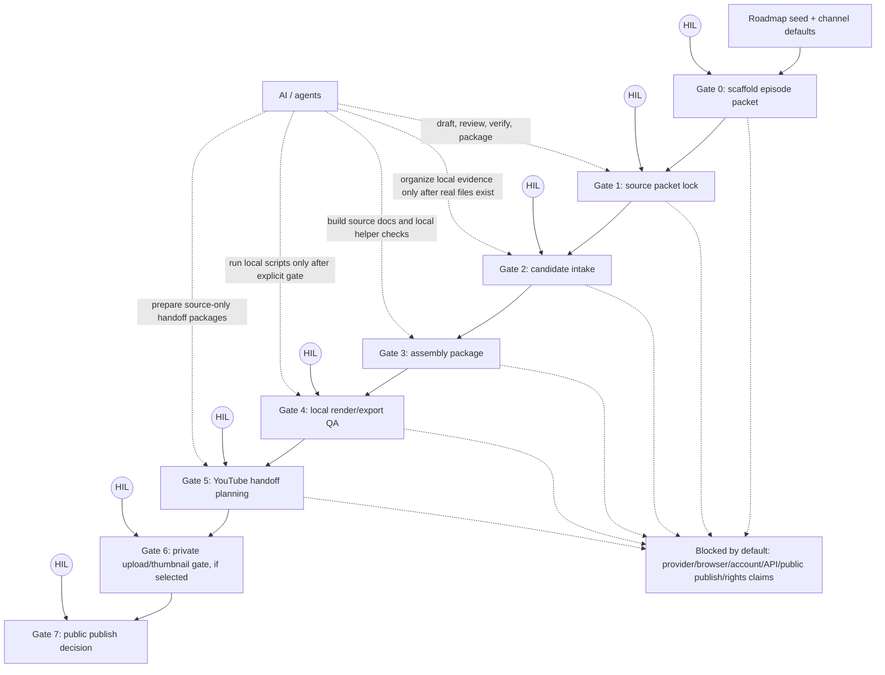

# Mellow Longplay Workflow Map

Status: active orientation map  
Updated: 2026-05-26

## 0. Read This First

This map explains where the workflow lives, where Human-In-The-Loop (HIL)
decisions happen, what AI/agents may do, and what evidence is required to pass
each gate.

Boundary: this map does not approve provider use, generated media, render/export,
upload, public publish, scheduling, API/browser/account automation, credential
storage, Content ID action, private analytics capture, or positive
rights/platform-safety claims.

## 1. Current Position

```text
S01E01: local QA + private YouTube API video/thumbnail evidence exists; public release remains blocked.
S01E02: workflow scaffold helper exists; episode packet has not been created unless the user runs the bootstrap command.
```

For S01E02, the next safe action is still source-only:

```bash
bash scripts/dev-python.sh scripts/bootstrap_episode_packet.py --s01e02 --dry-run
```

If the dry-run list is correct, create the packet:

```bash
bash scripts/dev-python.sh scripts/bootstrap_episode_packet.py --s01e02
bash scripts/verify-standalone.sh
```

## 2. Big Picture Diagram



Legend:

- `HIL` = user/human approval, review, or user-owned external action.
- AI/agents can draft, review, verify, sync docs/tracking, and run local scripts
  only inside the current approved gate.
- External provider/account actions remain blocked unless a narrow explicit gate
  opens that exact action.

## 3. Channels / Surfaces

| Surface | What it is for | Who owns it | Allowed now | Blocked unless explicit gate |
|---|---|---|---|---|
| `channel/channel.md`, `channel/roadmap.md` | channel promise and roadmap seed | repo/source | cite defaults | changing channel promise without review |
| `channel/templates/` | reusable source-only runbooks/checklists | repo/source | copy/adapt into episode docs | treating templates as approval |
| `channel/episodes/<episode-id>/manifest.json` | episode truth file | repo/source | state summary after packet exists | fake state, media, release facts |
| `reviews/current-state.md` | human-readable current gate/status | repo/source | sync after state changes | stale or memory-only state |
| `source/*.md` | lyrics, Suno fields, visual, metadata source | AI drafts + HIL approves | write/review source | provider/media/release approval |
| `tracking/*.csv` | durable provenance/assets/status/decisions | repo/source | record only real facts | invented candidate IDs/provenance |
| `candidates/` | ignored local evidence media | user/local evidence | add only after files exist and gate opens | tracked media, fake paths, provider downloads |
| `scripts/dev-python.sh`, `scripts/run-tests.sh` | repo Python/test runner through `uv` | repo/tooling | verification | `rtk pytest`, bare `python3 -m pytest` |
| YouTube/Suno/browser/provider | external accounts/platforms | user-owned unless explicit gate | blocked by default | automation/account/API/public publish |

## 4. Gate Evidence Matrix

| Gate | Purpose | AI/agents may do | HIL must do | Evidence required to pass | Output / next gate |
|---:|---|---|---|---|---|
| 0 | Scaffold source packet | run bootstrap dry-run/create command, create source/review/tracking placeholders | confirm episode seed/slug if needed | `manifest.json`, `reviews/current-state.md`, source placeholders, tracking CSVs, `verify-standalone` pass | source packet exists; no media/external facts |
| 1 | Lock source packet | draft episode spine, track plan, lyrics, Suno fields, prompt pack; run lyric/Suno reviews; sync docs | approve direction, reject/accept tracks, resolve story/style decisions | `source/songs.md`, `source/suno-manual-fields.md`, `source/suno-tracks/*.md`, prompt/source reviews, tracking rows | source-only song/provider handoff package candidate |
| 2 | Candidate intake | organize supplied local files, map selected/pool, run local technical QA, record compact provenance | supply real local files; listen/select or approve selection | real file paths under `candidates/`, asset/provenance/status rows, intake review, no invented IDs | selected draft media evidence |
| 3 | Assembly package | create sequence/chapter plan, metadata/disclosure draft, subtitle plan | accept duration/order/metadata direction | assembly review, metadata source, chapter plan, subtitle plan, blocked-claim scan | source-only assembly package |
| 4 | Local render/export QA | run local render/export helper only after explicit gate; mechanical QA; sidecar checks | approve final local watch/listen/visual QA | final local asset path, codec/duration/resolution checks, sidecar match, snapshots/spot pass, review/tracking sync | internal local QA asset |
| 5 | YouTube handoff planning | prepare source-only manual/API package and dry-run plan | final asset selection, current account/policy check, provenance/risk acceptance, rollback owner | final asset list, metadata/disclosure review, current official policy/account check, no-store hygiene, release-decision review | manual/API gate request only |
| 6 | Private upload/thumbnail, if selected | only under explicit execution gate: channel verification helper, private upload or thumbnail action | provide expected channel ID/env paths/video ID; authorize exact action | external env outside repo, channel ID verification, API result recorded, no credentials in repo, privacy private by default | private platform evidence; public still blocked |
| 7 | Public publish decision | prepare final checklist and record user decision after action if asked | own public publish/schedule/visibility action and rollback decision | explicit final approval, current platform/account check, final metadata/assets, user-owned action record | public release record or hold |

## 5. HIL Checklist By Gate

| HIL point | Human answer needed | If human says no / unclear |
|---|---|---|
| Episode seed | Is the roadmap seed/episode direction correct? | stay at Gate 0/shape |
| Track approvals | Are title, lyric, structure, and style deltas acceptable? | revise only affected track/source |
| Candidate files | Are these real local files and is selection acceptable? | do not create IDs/provenance |
| Listening/visual QA | Does the selected media/render pass human watch/listen? | revise, swap, or rerender only behind gate |
| Final asset selection | Is this exact MP4/thumbnail/sidecar/metadata the intended handoff set? | hold release planning |
| Account/platform check | Did user check account state, limits, disclosure UI, warnings/strikes? | no upload/public-publish gate |
| Public publish | Does user explicitly approve public visibility/schedule? | stay private/hold |

## 6. AI / Agent Responsibility Split

| Role | Can do | Must not do |
|---|---|---|
| Aries/Mayr | integrate plan, edit docs/scripts, run verification, sync source truth | invent facts, skip gates, claim release/rights/platform safety |
| Songwriting/review agents | draft/review original lyrics, Suno source fields, pattern/lexical checks | operate Suno/provider, imitate named artists/songs/voices |
| Visual agents | source-only visual prompts/layout reviews | generate/edit images or use references as provider inputs without gate |
| Production/readiness agents | check worksheet/tracking/readiness consistency | approve public publish or platform safety |
| Local scripts | bootstrap packets, verify JSON/CSV, run local QA helpers when gated | store secrets, mutate accounts unless exact gate opens |

## 7. Start Here For S01E02

1. Create Gate 0 packet only after dry-run:

   ```bash
   bash scripts/dev-python.sh scripts/bootstrap_episode_packet.py --s01e02 --dry-run
   bash scripts/dev-python.sh scripts/bootstrap_episode_packet.py --s01e02
   bash scripts/verify-standalone.sh
   ```

2. Then work Gate 1 source packet:

   - define Episode Style & Theme Spine;
   - for EP03 onward, cite the channel/roadmap creative delta: no planned sax,
     piano still allowed, exactly one non-sax special instrument in exactly one
     song, and several feeling/mood-led tracks;
   - draft track list one by one;
   - for each song, require Story + Reference Brief, Track Delta, structure
     fingerprint, micro-pattern matrix, lexical count ledger, and Suno 5.5 fields;
   - update `manifest.json`, `reviews/current-state.md`, source docs, reviews,
     and tracking rows together when durable state changes.

3. Do not open candidate intake until real local files exist.

4. Do not open render/export until selected media, subtitles, sequence, metadata,
   and explicit local render gate exist.

5. Do not open YouTube/API/public publish until final local QA asset exists and a
   release-decision gate records current policy/account checks and user approval.

## 8. Common Confusions

| Confusion | Correct rule |
|---|---|
| “Worksheet pass means upload/publish is ok?” | No. Internal candidate is not upload/public publish approval. |
| “Candidate ID can be reserved before files?” | No. Candidate IDs only after real local files exist. |
| “AI can run Suno/YouTube if source is ready?” | No. Provider/account/API/browser actions need separate explicit gate. |
| “Private upload means public release passed?” | No. Private upload evidence is not public publish approval. |
| “Readiness score >=90 means platform safe?” | No. It means internal source/readiness candidate only. |
| “Can we store OAuth/token/env in repo?” | No. Use external env path; credentials/tokens stay outside repo. |

## 9. Source Paths To Trust

- Channel boundary: `docs/operating-boundary.md`, `docs/provider-platform-boundary.md`.
- Current knowledge summary: `KNOWLEDGE.md`.
- S01E02 bootstrap/runbook: `scripts/bootstrap_episode_packet.py`,
  `channel/templates/episode-zero-to-youtube-runbook-template.md`.
- Fastlane worksheet: `channel/templates/episode-production-worksheet-template.md`.
- Python runner policy: `docs/python-uv-policy.md`, `scripts/dev-python.sh`,
  `scripts/run-tests.sh`.
